# 💰 REIMBURSEMENT FEATURE - Hệ thống Hoàn Tiền

## 🎯 Overview

**Major changes** to lunch and snack ordering workflows to support **reimbursement flow** where users pay upfront and get reimbursed by admin.

**Key Changes:**
1. ✅ **Any user** can create snack menus (not admin-only)
2. ✅ **Reimbursement workflow** for both lunch buyers and snack creators
3. ✅ **Auto-close** lunch sessions at 11:30 AM

**Priority:** P0 - Urgent implementation required

---

## 🗄️ Database Schema Changes

### 1. New Table: reimbursements

```sql
CREATE TABLE reimbursements (
  id SERIAL PRIMARY KEY,
  
  -- Who paid upfront
  user_id INTEGER NOT NULL REFERENCES users(id) ON DELETE CASCADE,
  
  -- Amount to reimburse
  amount DECIMAL(12, 2) NOT NULL CHECK (amount > 0),
  
  -- Type & relation
  type VARCHAR(30) NOT NULL CHECK (type IN ('lunch_buyer', 'snack_creator')),
  related_id INTEGER NOT NULL, -- lunch_sessions.id or snack_menus.id
  
  -- Status workflow
  status VARCHAR(30) DEFAULT 'pending' CHECK (
    status IN ('pending', 'transferred', 'confirmed', 'disputed')
  ),
  
  -- Timestamps
  created_at TIMESTAMP DEFAULT CURRENT_TIMESTAMP,
  admin_transferred_at TIMESTAMP,
  admin_transferred_by INTEGER REFERENCES users(id),
  user_confirmed_at TIMESTAMP,
  
  -- User confirmation
  user_confirmation VARCHAR(20) CHECK (user_confirmation IN ('received', 'not_received')),
  
  -- Notes
  admin_note TEXT,
  user_note TEXT,
  
  -- Metadata
  metadata JSONB -- Extra data: bank transfer reference, etc.
);

CREATE INDEX idx_reimbursements_user ON reimbursements(user_id, created_at DESC);
CREATE INDEX idx_reimbursements_status ON reimbursements(status, created_at DESC);
CREATE INDEX idx_reimbursements_type ON reimbursements(type);
CREATE INDEX idx_reimbursements_related ON reimbursements(type, related_id);
```

---

### 2. Update lunch_sessions Table

```sql
ALTER TABLE lunch_sessions
  ADD COLUMN actual_cost DECIMAL(12, 2), -- Actual amount buyer paid
  ADD COLUMN cost_per_person DECIMAL(12, 2), -- Calculated: actual_cost / participants
  ADD COLUMN buyer_id INTEGER REFERENCES users(id), -- Who paid for lunch
  ADD COLUMN payment_submitted_at TIMESTAMP, -- When buyer submitted payment
  ADD COLUMN finalized_by INTEGER REFERENCES users(id); -- Admin who finalized

-- Add new status values
ALTER TABLE lunch_sessions
  DROP CONSTRAINT IF EXISTS lunch_sessions_status_check;
  
ALTER TABLE lunch_sessions
  ADD CONSTRAINT lunch_sessions_status_check 
  CHECK (status IN (
    'ordering',     -- Users can join/leave
    'closed',       -- 11:30 AM auto-close, no more changes
    'payment_submitted', -- Buyer submitted cost
    'finalized',    -- Admin finalized, reimbursement created
    'cancelled'
  ));

CREATE INDEX idx_lunch_sessions_buyer ON lunch_sessions(buyer_id);
CREATE INDEX idx_lunch_sessions_finalized ON lunch_sessions(finalized_by);
```

---

### 3. Update snack_menus Table

```sql
ALTER TABLE snack_menus
  ADD COLUMN total_cost DECIMAL(12, 2), -- Total cost creator paid (calculated on finalize)
  ADD COLUMN finalized_by INTEGER REFERENCES users(id), -- Who finalized (creator or admin)
  ADD COLUMN finalized_at TIMESTAMP;

-- Update status constraint to clarify
ALTER TABLE snack_menus
  DROP CONSTRAINT IF EXISTS snack_menus_status_check;
  
ALTER TABLE snack_menus
  ADD CONSTRAINT snack_menus_status_check
  CHECK (status IN ('draft', 'active', 'finalized', 'cancelled'));

CREATE INDEX idx_snack_menus_finalized ON snack_menus(finalized_by);
```

---

### 4. Migration Script

```sql
-- Migration: Add reimbursement feature
-- Version: 2025-02-26-reimbursement

BEGIN;

-- Step 1: Create reimbursements table
CREATE TABLE reimbursements (...);

-- Step 2: Update lunch_sessions
ALTER TABLE lunch_sessions ADD COLUMN actual_cost DECIMAL(12, 2);
ALTER TABLE lunch_sessions ADD COLUMN cost_per_person DECIMAL(12, 2);
ALTER TABLE lunch_sessions ADD COLUMN buyer_id INTEGER REFERENCES users(id);
ALTER TABLE lunch_sessions ADD COLUMN payment_submitted_at TIMESTAMP;
ALTER TABLE lunch_sessions ADD COLUMN finalized_by INTEGER REFERENCES users(id);
ALTER TABLE lunch_sessions DROP CONSTRAINT lunch_sessions_status_check;
ALTER TABLE lunch_sessions ADD CONSTRAINT lunch_sessions_status_check 
  CHECK (status IN ('ordering', 'closed', 'payment_submitted', 'finalized', 'cancelled'));

-- Step 3: Update snack_menus
ALTER TABLE snack_menus ADD COLUMN total_cost DECIMAL(12, 2);
ALTER TABLE snack_menus ADD COLUMN finalized_by INTEGER REFERENCES users(id);
ALTER TABLE snack_menus ADD COLUMN finalized_at TIMESTAMP;
ALTER TABLE snack_menus DROP CONSTRAINT snack_menus_status_check;
ALTER TABLE snack_menus ADD CONSTRAINT snack_menus_status_check
  CHECK (status IN ('draft', 'active', 'finalized', 'cancelled'));

-- Step 4: Add indexes
CREATE INDEX idx_reimbursements_user ON reimbursements(user_id, created_at DESC);
CREATE INDEX idx_reimbursements_status ON reimbursements(status, created_at DESC);
CREATE INDEX idx_reimbursements_type ON reimbursements(type);
CREATE INDEX idx_lunch_sessions_buyer ON lunch_sessions(buyer_id);
CREATE INDEX idx_snack_menus_finalized ON snack_menus(finalized_by);

-- Step 5: Migrate existing data
-- Update old 'settled' status to 'finalized'
UPDATE lunch_sessions SET status = 'finalized' WHERE status = 'settled';
UPDATE snack_menus SET status = 'finalized' WHERE status = 'closed';

COMMIT;
```

**Rollback:**
```sql
BEGIN;
DROP TABLE reimbursements;
ALTER TABLE lunch_sessions DROP COLUMN actual_cost;
ALTER TABLE lunch_sessions DROP COLUMN cost_per_person;
ALTER TABLE lunch_sessions DROP COLUMN buyer_id;
ALTER TABLE lunch_sessions DROP COLUMN payment_submitted_at;
ALTER TABLE lunch_sessions DROP COLUMN finalized_by;
ALTER TABLE snack_menus DROP COLUMN total_cost;
ALTER TABLE snack_menus DROP COLUMN finalized_by;
ALTER TABLE snack_menus DROP COLUMN finalized_at;
COMMIT;
```

---

## 🔌 API Endpoints

### Lunch Ordering Endpoints (Updated)

#### 1. POST /api/orders/today/submit-payment

**[Buyer only]** Submit actual cost after session closed.

**Authorization:** User must be one of the selected buyers

**Request:**
```json
{
  "actualCost": 500000,
  "note": "Quán Cơm Tấm 37"
}
```

**Response (200):**
```json
{
  "success": true,
  "message": "Payment submitted successfully",
  "data": {
    "sessionId": 50,
    "actualCost": 500000,
    "participants": 15,
    "costPerPerson": 33333,
    "breakdown": {
      "totalDeducted": 500000,
      "reimbursementAmount": 500000
    }
  }
}
```

**Process (Atomic Transaction):**
1. Validate session status = 'closed'
2. Validate user is buyer (in buyer_ids array)
3. Calculate costPerPerson = actualCost / participantCount
4. Deduct costPerPerson from each participant's balance
5. Create transaction records (type='lunch_order')
6. Update session:
   - actual_cost = actualCost
   - cost_per_person = costPerPerson
   - buyer_id = current user
   - payment_submitted_at = NOW()
   - status = 'payment_submitted'
7. Create reimbursement record:
   - user_id = buyer
   - amount = actualCost
   - type = 'lunch_buyer'
   - related_id = sessionId
   - status = 'pending'
8. Send notification to admin
9. Commit transaction

**Errors:**
- 403: Not a buyer for this session
- 400: Session not closed yet
- 400: Payment already submitted
- 400: Insufficient balance for some users (skip or fail?)

---

#### 2. POST /api/orders/:sessionId/finalize

**[Admin only]** Finalize session (for old flow, backward compatibility).

**Deprecated:** This endpoint is now for admin override only. Normal flow uses `/submit-payment`.

---

### Reimbursement Endpoints (New)

#### 3. GET /api/reimbursements/my

Get own reimbursement requests.

**Response (200):**
```json
{
  "success": true,
  "data": [
    {
      "id": 1,
      "amount": 500000,
      "type": "lunch_buyer",
      "relatedId": 50,
      "relatedTitle": "Cơm 24/02",
      "status": "pending",
      "createdAt": "2025-02-24T13:00:00Z",
      "adminTransferredAt": null,
      "userConfirmedAt": null
    },
    {
      "id": 2,
      "amount": 300000,
      "type": "snack_creator",
      "relatedId": 5,
      "relatedTitle": "Menu 25/02",
      "status": "transferred",
      "createdAt": "2025-02-25T15:00:00Z",
      "adminTransferredAt": "2025-02-25T16:00:00Z",
      "userConfirmedAt": null
    }
  ]
}
```

---

#### 4. GET /api/admin/reimbursements

**[Admin only]** List all reimbursement requests.

**Query params:**
- `status` (pending | transferred | confirmed | disputed | all)
- `type` (lunch_buyer | snack_creator | all)
- `limit` (default: 50)
- `offset` (default: 0)

**Response (200):**
```json
{
  "success": true,
  "data": {
    "reimbursements": [
      {
        "id": 1,
        "user": {
          "id": 5,
          "name": "Nguyen Van A",
          "email": "a@example.com"
        },
        "amount": 500000,
        "type": "lunch_buyer",
        "relatedId": 50,
        "relatedTitle": "Cơm 24/02",
        "status": "pending",
        "createdAt": "2025-02-24T13:00:00Z",
        "note": null
      },
      {
        "id": 2,
        "user": {
          "id": 3,
          "name": "Tran Thi B"
        },
        "amount": 300000,
        "type": "snack_creator",
        "relatedId": 5,
        "relatedTitle": "Menu 25/02",
        "status": "transferred",
        "createdAt": "2025-02-25T15:00:00Z",
        "adminTransferredAt": "2025-02-25T16:00:00Z",
        "adminTransferredBy": { "id": 1, "name": "Admin" }
      }
    ],
    "summary": {
      "pending": 5,
      "pendingTotal": 2500000,
      "transferred": 3,
      "confirmed": 10
    },
    "total": 18,
    "limit": 50,
    "offset": 0
  }
}
```

---

#### 5. POST /api/admin/reimbursements/:id/transfer

**[Admin only]** Mark reimbursement as transferred (admin paid).

**Request:**
```json
{
  "note": "Transferred via bank",
  "bankReference": "FT2025022512345"
}
```

**Response (200):**
```json
{
  "success": true,
  "message": "Reimbursement marked as transferred",
  "data": {
    "reimbursementId": 1,
    "status": "transferred",
    "transferredAt": "2025-02-25T16:30:00Z"
  }
}
```

**Process:**
1. Validate reimbursement exists & status = 'pending'
2. Update reimbursement:
   - status = 'transferred'
   - admin_transferred_at = NOW()
   - admin_transferred_by = current admin
   - admin_note = note
   - metadata.bankReference = bankReference
3. Send notification to user (with confirm buttons)

**Errors:**
- 404: Reimbursement not found
- 400: Already transferred/confirmed

---

#### 6. POST /api/reimbursements/:id/confirm

**[User]** Confirm received or not received.

**Request:**
```json
{
  "confirmation": "received",
  "note": "Đã nhận, cảm ơn"
}
```

**Response (200):**
```json
{
  "success": true,
  "message": "Confirmation recorded",
  "data": {
    "reimbursementId": 1,
    "status": "confirmed",
    "confirmation": "received",
    "confirmedAt": "2025-02-25T17:00:00Z"
  }
}
```

**Process:**
1. Validate reimbursement exists & status = 'transferred'
2. Validate user_id matches current user
3. Update reimbursement:
   - status = 'confirmed' (if received) OR 'disputed' (if not_received)
   - user_confirmation = confirmation
   - user_confirmed_at = NOW()
   - user_note = note
4. If 'not_received', send alert to admin

**Errors:**
- 403: Not your reimbursement
- 400: Not yet transferred
- 400: Already confirmed

---

### Snack Ordering Endpoints (Updated)

#### 7. POST /api/snacks/upload (Updated)

**Remove admin-only restriction.**

**Authorization:** Any authenticated user

**Same request/response as before**

---

#### 8. POST /api/snacks/menus (Updated)

**Remove admin-only restriction.**

**Authorization:** Any authenticated user

**Same request/response, but `created_by` = current user**

---

#### 9. POST /api/snacks/menus/:id/finalize (Updated)

**Authorization:** Creator OR Admin

**New check:**
```javascript
if (menu.created_by !== req.user.id && req.user.role !== 'admin') {
  return res.status(403).json({ error: 'Only creator or admin can finalize' });
}
```

**Process (Updated):**
1. Same as before (deduct from orderers)
2. Calculate total_cost = SUM(all orders subtotal)
3. Update menu:
   - total_cost = calculated total
   - finalized_by = current user
   - finalized_at = NOW()
   - status = 'finalized'
4. **If finalized_by is NOT admin:**
   - Create reimbursement record:
     - user_id = finalized_by
     - amount = total_cost
     - type = 'snack_creator'
     - related_id = menuId
     - status = 'pending'
   - Send notification to admin
5. **If finalized_by IS admin:**
   - No reimbursement needed

---

### Auto-Close Endpoint

#### 10. POST /api/cron/close-lunch-sessions

**[System/Admin]** Close lunch sessions at 11:30 AM.

**Authorization:** System cron job OR admin with API key

**Response (200):**
```json
{
  "success": true,
  "message": "Closed 1 session",
  "data": {
    "closedSessions": [
      {
        "sessionId": 50,
        "sessionDate": "2025-02-26",
        "participants": 15
      }
    ]
  }
}
```

**Process:**
1. Find lunch_sessions with:
   - session_date = TODAY
   - status = 'ordering'
2. Update status = 'closed'
3. Send notification to buyers: "Session closed, please submit payment"

---

## 🔐 Permission Matrix

| Action | User | Admin | Creator (Snack) | Buyer (Lunch) |
|--------|------|-------|-----------------|---------------|
| Create snack menu | ✅ | ✅ | - | - |
| Finalize snack menu | ❌ | ✅ | ✅ (own) | - |
| Submit lunch payment | ❌ | ✅ | - | ✅ (if selected) |
| View own reimbursements | ✅ | ✅ | ✅ | ✅ |
| View all reimbursements | ❌ | ✅ | ❌ | ❌ |
| Mark as transferred | ❌ | ✅ | ❌ | ❌ |
| Confirm received | ✅ (own) | ✅ (own) | ✅ (own) | ✅ (own) |

---

## 🎨 Frontend Design

### New Pages

#### 1. Reimbursements Page (`/reimbursements`)

**For Users:**

**Layout:**
```
┌─────────────────────────────────────┐
│ ←  Yêu Cầu Hoàn Tiền               │
├─────────────────────────────────────┤
│  Tabs: [ Pending ] [ History ]      │
│                                     │
│  === Pending Tab ===                │
│                                     │
│  ┌──────────────────────────────┐  │
│  │ 💰 Cơm 24/02                 │  │
│  │ Số tiền: 500,000đ            │  │
│  │ Status: ⏳ Đang chờ admin    │  │
│  │ Ngày: 24/02 13:00            │  │
│  └──────────────────────────────┘  │
│                                     │
│  ┌──────────────────────────────┐  │
│  │ 🍕 Menu 25/02                │  │
│  │ Số tiền: 300,000đ            │  │
│  │ Status: ✅ Admin đã chuyển   │  │
│  │ Ngày chuyển: 25/02 16:00     │  │
│  │                              │  │
│  │ Bạn đã nhận được tiền?       │  │
│  │ [ Đã nhận ] [ Chưa nhận ]    │  │
│  └──────────────────────────────┘  │
│                                     │
│  === History Tab ===                │
│                                     │
│  ┌──────────────────────────────┐  │
│  │ ✅ Cơm 23/02 - 450,000đ      │  │
│  │ Xác nhận: Đã nhận - 23/02    │  │
│  └──────────────────────────────┘  │
│                                     │
└─────────────────────────────────────┘
```

**Features:**
- List own reimbursements
- Status badges (pending/transferred/confirmed)
- For 'transferred' status → Show confirm buttons
- Click "Đã nhận" → POST /api/reimbursements/:id/confirm (received)
- Click "Chưa nhận" → POST /api/reimbursements/:id/confirm (not_received)
- History tab shows confirmed reimbursements

---

#### 2. Admin Reimbursements Page (`/admin/reimbursements`)

**Layout:**
```
┌─────────────────────────────────────┐
│ 🔧 Quản Lý Hoàn Tiền               │
├─────────────────────────────────────┤
│  Filter: [All ▼] [Pending] [Transferred] [Confirmed] │
│  Type: [All ▼] [Lunch] [Snacks]    │
│                                     │
│  📊 Summary:                        │
│  Pending: 5 requests (2,500,000đ)  │
│                                     │
│  ┌──────────────────────────────┐  │
│  │ Table:                       │  │
│  │ User | Amount | Type | Date  │  │
│  │ A    | 500k   | 🍱  | 24/02  │  │
│  │ [Mark as Transferred]        │  │
│  │                              │  │
│  │ B    | 300k   | 🍕  | 25/02  │  │
│  │ ✅ Transferred (25/02 16:00) │  │
│  │ Waiting user confirmation    │  │
│  │                              │  │
│  │ C    | 450k   | 🍱  | 23/02  │  │
│  │ ✅ Confirmed (23/02 17:00)   │  │
│  └──────────────────────────────┘  │
│                                     │
└─────────────────────────────────────┘
```

**Features:**
- Table with filters (status, type)
- Summary stats (pending count + total)
- "Mark as Transferred" button for pending items
- Dialog for transfer confirmation:
  - Input: Note, Bank reference
  - Confirm button
- Status indicators (pending/transferred/confirmed/disputed)
- Alert badge for disputed items

---

### Updated Pages

#### 3. Dashboard (`/`) - Add Reimbursements Link

**Add Quick Action:**
```
┌─────────────────────────────────────┐
│  Quick Actions:                     │
│  [ Nạp tiền ] [ Đặt cơm ]           │
│  [ Yêu cầu hoàn tiền ] (badge: 2)   │
└─────────────────────────────────────┘
```

**Badge shows:**
- Pending reimbursements count
- Transferred (waiting confirmation) count

---

#### 4. Order Today Page (`/order`) - Add Payment Button

**After session closes (status='closed'):**

**If user is buyer:**
```
┌─────────────────────────────────────┐
│  Status: 🔒 Đã đóng (11:30 AM)      │
│                                     │
│  ⚠️ Bạn là người đi mua hôm nay    │
│                                     │
│  [ Tôi đã trả tiền ]                │
│                                     │
└─────────────────────────────────────┘
```

**Click button → Open modal:**
```
┌─────────────────────────────────────┐
│  Xác nhận thanh toán                │
├─────────────────────────────────────┤
│  15 người đã đặt cơm                │
│                                     │
│  Tổng tiền bạn đã trả:              │
│  ┌────────────────────────────┐    │
│  │ 500000                     │    │
│  └────────────────────────────┘    │
│                                     │
│  Ghi chú (optional):                │
│  ┌────────────────────────────┐    │
│  │ Quán Cơm Tấm 37            │    │
│  └────────────────────────────┘    │
│                                     │
│  Mỗi người sẽ bị trừ: 33,333đ      │
│                                     │
│  Bạn sẽ được hoàn: 500,000đ        │
│  (sau khi admin chuyển)             │
│                                     │
│  [ Hủy ] [ Xác nhận ]               │
│                                     │
└─────────────────────────────────────┘
```

**Process:**
- Input validation (amount > 0)
- Calculate per-person cost
- Show preview
- Submit → POST /api/orders/today/submit-payment
- Success → Navigate to /reimbursements

---

#### 5. Snack Menu List (`/snacks`) - Add "Create Menu" Button

**For all users (not just admin):**

```
┌─────────────────────────────────────┐
│  Đồ Ăn Vặt                          │
│                                     │
│  [ + Tạo Menu Mới ]                 │
│                                     │
│  (Existing menus...)                │
└─────────────────────────────────────┘
```

**Button links to:** `/snacks/upload`

---

#### 6. Snack Orders Management (`/snacks/menus/:id/orders`) - Updated

**If current user is creator OR admin:**

**Show finalize button:**
```
┌─────────────────────────────────────┐
│  Orders Summary                     │
│  Total: 300,000đ                    │
│                                     │
│  [ Finalize Orders ]                │
│                                     │
└─────────────────────────────────────┘
```

**Finalize confirmation dialog (if not admin):**
```
⚠️ Xác nhận quyết toán?

- Tổng tiền: 300,000đ
- 10 người sẽ bị trừ tiền
- Bạn sẽ được hoàn: 300,000đ
  (sau khi admin chuyển)

[ Hủy ] [ Xác nhận ]
```

---

## 🔔 Notifications

### Push Notifications

#### To Admin (Reimbursement Created)

```typescript
// When lunch buyer submits payment
await NotificationService.sendPushNotification(
  adminId,
  '💰 Yêu cầu hoàn tiền mới',
  `${user.name} đã trả tiền cơm: ${formatCurrency(amount)}`,
  {
    type: 'reimbursement_created',
    reimbursementId: reimbursement.id,
    action: '/admin/reimbursements'
  }
);

// When snack creator finalizes
await NotificationService.sendPushNotification(
  adminId,
  '💰 Yêu cầu hoàn tiền - Đồ ăn vặt',
  `${user.name} đã tạo đơn: ${formatCurrency(amount)}`,
  {
    type: 'reimbursement_created',
    reimbursementId: reimbursement.id,
    action: '/admin/reimbursements'
  }
);
```

---

#### To User (Admin Transferred)

```typescript
await NotificationService.sendPushNotification(
  userId,
  '✅ Admin đã chuyển tiền',
  `Đã chuyển ${formatCurrency(amount)} cho bạn`,
  {
    type: 'reimbursement_transferred',
    reimbursementId: reimbursement.id,
    action: '/reimbursements'
  }
);
```

**Action buttons in notification:**
- "Đã nhận" → Confirm received
- "Chưa nhận" → Confirm not received

---

#### To Admin (User Disputed)

```typescript
// If user clicks "Chưa nhận"
await NotificationService.sendPushNotification(
  adminId,
  '⚠️ Tranh chấp hoàn tiền',
  `${user.name} báo chưa nhận tiền`,
  {
    type: 'reimbursement_disputed',
    reimbursementId: reimbursement.id,
    action: `/admin/reimbursements/${reimbursement.id}`
  }
);
```

---

#### To Buyers (Session Closed)

```typescript
// At 11:30 AM when session auto-closes
await NotificationService.notifyBuyers(buyerIds, {
  title: '🔒 Đơn cơm đã đóng',
  body: 'Đến lượt bạn trả tiền. Vào app để xác nhận.',
  action: '/order'
});
```

---

## ⚙️ Auto-Close Implementation

### Cron Job Setup

```javascript
// backend/src/jobs/autoCloseLunch.js

const cron = require('node-cron');
const LunchSessionService = require('../services/LunchSessionService');
const NotificationService = require('../services/NotificationService');

// Run at 11:30 AM every day (Asia/Ho_Chi_Minh timezone)
cron.schedule('30 11 * * *', async () => {
  console.log('[CRON] Auto-closing lunch sessions at 11:30 AM');
  
  try {
    const closedSessions = await autoCloseTodaySessions();
    console.log(`[CRON] Closed ${closedSessions.length} sessions`);
    
    // Notify buyers
    for (const session of closedSessions) {
      await notifyBuyersToSubmitPayment(session);
    }
  } catch (error) {
    console.error('[CRON] Auto-close error:', error);
    // Alert admin via notification or email
  }
}, {
  timezone: 'Asia/Ho_Chi_Minh'
});

async function autoCloseTodaySessions() {
  const today = new Date().toISOString().split('T')[0];
  
  const result = await db.query(`
    UPDATE lunch_sessions
    SET status = 'closed', updated_at = NOW()
    WHERE session_date = $1
    AND status = 'ordering'
    RETURNING id, buyer_ids
  `, [today]);
  
  return result.rows;
}

async function notifyBuyersToSubmitPayment(session) {
  const buyers = session.buyer_ids; // Array of user IDs
  
  for (const buyerId of buyers) {
    await NotificationService.sendPushNotification(
      buyerId,
      '🔒 Đơn cơm đã đóng',
      'Đến lượt bạn trả tiền. Vào app để xác nhận số tiền.',
      {
        type: 'session_closed',
        sessionId: session.id,
        action: '/order'
      }
    );
  }
}

module.exports = { autoCloseTodaySessions };
```

---

### Scheduler Registration

```javascript
// backend/src/jobs/scheduler.js

const cron = require('node-cron');
const { selectBuyersJob } = require('./selectBuyers');
const { sendDailyReminder } = require('./dailyReminder');
const { autoCloseTodaySessions } = require('./autoCloseLunch'); // NEW

// 8:30 AM: Daily reminder
cron.schedule('30 8 * * *', sendDailyReminder, { timezone: 'Asia/Ho_Chi_Minh' });

// 11:30 AM: Auto-close lunch sessions
cron.schedule('30 11 * * *', async () => {
  await autoCloseTodaySessions();
}, { timezone: 'Asia/Ho_Chi_Minh' });

// (Optional) 11:35 AM: Select buyers (5 mins after close)
cron.schedule('35 11 * * *', selectBuyersJob, { timezone: 'Asia/Ho_Chi_Minh' });
```

**Alternative:** Keep buyer selection at original time (11:30), close happens right after selection.

---

## 🎣 Frontend Hooks

### useReimbursements Hook

```typescript
// lib/hooks/useReimbursements.ts

import { useEffect, useState } from 'react';
import { reimbursementsService } from '../api/services/reimbursements';

export const useReimbursements = () => {
  const [reimbursements, setReimbursements] = useState([]);
  const [loading, setLoading] = useState(true);
  
  useEffect(() => {
    fetchReimbursements();
  }, []);
  
  const fetchReimbursements = async () => {
    setLoading(true);
    try {
      const response = await reimbursementsService.getMy();
      setReimbursements(response.data);
    } catch (error) {
      console.error('Fetch reimbursements error:', error);
    } finally {
      setLoading(false);
    }
  };
  
  const confirmReceived = async (id: number, received: boolean) => {
    await reimbursementsService.confirm(id, received ? 'received' : 'not_received');
    await fetchReimbursements(); // Refresh
  };
  
  const pendingCount = reimbursements.filter(r => r.status === 'pending').length;
  const transferredCount = reimbursements.filter(r => r.status === 'transferred').length;
  
  return {
    reimbursements,
    loading,
    refresh: fetchReimbursements,
    confirmReceived,
    pendingCount,
    transferredCount,
  };
};
```

---

## 🧩 State Management

### Update authStore

```typescript
// lib/store/authStore.ts (extend)

interface AuthState {
  // ... existing
  
  // New
  hasUnconfirmedReimbursements: boolean;
  refreshReimbursementStatus: () => Promise<void>;
}

export const useAuthStore = create<AuthState>((set, get) => ({
  // ... existing
  
  hasUnconfirmedReimbursements: false,
  
  refreshReimbursementStatus: async () => {
    try {
      const response = await reimbursementsService.getMy();
      const hasUnconfirmed = response.data.some(r => r.status === 'transferred');
      set({ hasUnconfirmedReimbursements: hasUnconfirmed });
    } catch (error) {
      console.error('Refresh reimbursement status error:', error);
    }
  },
}));
```

**Usage:**
- Call `refreshReimbursementStatus()` on app mount
- Show badge on dashboard if `hasUnconfirmedReimbursements === true`

---

## 📊 Workflow Diagrams

### Lunch Reimbursement Flow

```mermaid
sequenceDiagram
    participant User as User/Buyer
    participant System as Backend
    participant Admin as Admin
    participant DB as Database

    Note over User,DB: 1. Session Auto-Close (11:30 AM)
    System->>DB: UPDATE lunch_sessions SET status='closed'
    System->>User: 🔔 "Session closed, please submit payment"

    Note over User,DB: 2. Buyer Submits Payment
    User->>System: POST /api/orders/today/submit-payment
    System->>DB: BEGIN TRANSACTION
    System->>DB: Calculate costPerPerson
    loop For each participant
        System->>DB: Deduct costPerPerson from balance
        System->>DB: Create transaction record
    end
    System->>DB: Update session (actual_cost, buyer_id, status='payment_submitted')
    System->>DB: Create reimbursement (status='pending')
    System->>DB: COMMIT TRANSACTION
    System->>Admin: 🔔 "User A paid 500k for lunch"

    Note over User,DB: 3. Admin Transfers Money
    Admin->>System: POST /api/admin/reimbursements/:id/transfer
    System->>DB: UPDATE reimbursements SET status='transferred'
    System->>User: 🔔 "Admin transferred 500k"

    Note over User,DB: 4. User Confirms Received
    User->>System: POST /api/reimbursements/:id/confirm (received)
    System->>DB: UPDATE reimbursements SET status='confirmed'
    System->>Admin: 🔔 "User confirmed received"
```



---

### Snack Reimbursement Flow


---

## 🚀 Implementation Plan

### Phase 1: Backend - Database & Core (4-5 hours)

**Step 1: Database Migration (1h)**
- Create `reimbursements` table
- Alter `lunch_sessions` table
- Alter `snack_menus` table
- Add indexes
- Migrate existing data
- Test migrations

**Step 2: Reimbursement Service (1.5h)**
- Create ReimbursementService.js
- Methods:
  - createReimbursement()
  - getByUser()
  - getAll() (admin)
  - markAsTransferred() (admin)
  - confirmReceived() (user)
- Unit tests

**Step 3: Update LunchSessionService (1h)**
- Update submitPayment() method (new logic)
- Create reimbursement after deducting balances
- Handle edge cases (insufficient balance)

**Step 4: Update SnackService (1h)**
- Remove admin-only checks
- Update finalize() to create reimbursement
- Check if finalized_by is admin

**Step 5: Cron Job (30 mins)**
- Implement autoCloseLunch.js
- Register in scheduler
- Test timing

---

### Phase 2: Backend - API Endpoints (3-4 hours)

**Step 6: Reimbursement Endpoints (2h)**
- GET /api/reimbursements/my
- GET /api/admin/reimbursements
- POST /api/admin/reimbursements/:id/transfer
- POST /api/reimbursements/:id/confirm
- Add validation & error handling
- Test with Postman

**Step 7: Update Lunch Endpoints (1h)**
- POST /api/orders/today/submit-payment (new)
- Update existing endpoints
- Test integration

**Step 8: Update Snack Endpoints (1h)**
- Remove requireAdmin middleware
- Update permission checks
- Test access control

---

### Phase 3: Frontend - User Pages (5-6 hours)

**Step 9: Reimbursements Page (2h)**
- Create /reimbursements page
- List pending/transferred/confirmed
- Confirm buttons
- API integration

**Step 10: Update Order Page (1.5h)**
- Add "Tôi đã trả tiền" button (buyers only)
- Payment submission modal
- Success flow

**Step 11: Update Snack Pages (1.5h)**
- Add "Create Menu" button for all users
- Update finalize page (creator access)
- Finalize confirmation dialog (reimbursement mention)

**Step 12: Dashboard Updates (1h)**
- Add reimbursements quick action
- Badge for unconfirmed reimbursements
- useReimbursements hook

---

### Phase 4: Frontend - Admin Pages (2-3 hours)

**Step 13: Admin Reimbursements Page (2h)**
- Create /admin/reimbursements page
- Table with filters
- Mark as transferred dialog
- Status tracking

**Step 14: Notifications UI (1h)**
- Push notification handling
- Action buttons (Đã nhận / Chưa nhận)
- Deep linking

---

### Phase 5: Testing & Polish (2-3 hours)

**Step 15: Integration Testing (1.5h)**
- Full flow: Lunch (buyer submit → admin transfer → user confirm)
- Full flow: Snack (creator finalize → admin transfer → user confirm)
- Edge cases:
  - Insufficient balance
  - Multiple buyers
  - User disputes
  - Admin is creator

**Step 16: UI/UX Polish (1h)**
- Loading states
- Error messages
- Success toasts
- Responsive design check

**Step 17: Bug Fixes (30 mins)**
- Fix discovered issues
- Final testing

---

## ✅ Acceptance Criteria

**Must Have:**
- [ ] Any user can create snack menus
- [ ] Lunch buyer can submit payment after session closed
- [ ] Snack creator can finalize menu (non-admin)
- [ ] Reimbursement created after lunch payment / snack finalize
- [ ] Admin can view all reimbursements
- [ ] Admin can mark as transferred
- [ ] User receives notification when transferred
- [ ] User can confirm received / not received
- [ ] Disputed reimbursements alert admin
- [ ] Lunch sessions auto-close at 11:30 AM
- [ ] Buyers notified after auto-close
- [ ] Unified history works with new workflow

**Edge Cases:**
- [ ] Handle insufficient balance for some users (skip vs fail)
- [ ] Multiple buyers trying to submit payment (only first succeeds)
- [ ] Admin transfers same reimbursement twice (prevent)
- [ ] User confirms multiple times (prevent)
- [ ] Creator is admin (no reimbursement needed)

---

## 🔒 Security Considerations

1. **Authorization:**
   - Validate user owns reimbursement before confirm
   - Validate user is creator before finalize
   - Validate user is buyer before submit payment
   - Admin-only endpoints properly protected

2. **Race Conditions:**
   - Lock lunch_sessions during payment submission
   - Lock snack_menus during finalization
   - Use database transactions

3. **Balance Validation:**
   - Check all users have sufficient balance before deducting
   - Handle cases where some users don't have enough
   - Option: Skip insufficient balance users OR fail entire operation

4. **Input Validation:**
   - Validate actualCost > 0
   - Validate confirmation values ('received' | 'not_received')
   - Sanitize notes

---

## 📝 Testing Checklist

### Backend
- [ ] Reimbursement creation (lunch)
- [ ] Reimbursement creation (snack)
- [ ] Admin transfer
- [ ] User confirm
- [ ] Permissions (creator/admin/buyer)
- [ ] Auto-close cron
- [ ] Atomic transactions
- [ ] Error handling

### Frontend
- [ ] Reimbursements page displays correctly
- [ ] Payment submission modal
- [ ] Confirm buttons work
- [ ] Admin page filters
- [ ] Notifications work
- [ ] Badge updates
- [ ] Responsive design

### Integration
- [ ] Full lunch flow
- [ ] Full snack flow
- [ ] Disputed reimbursement flow
- [ ] Multiple sessions/menus
- [ ] Admin is creator (no reimbursement)

---

## ✅ Done!

Reimbursement feature design hoàn chỉnh! Key points:

1. ✅ **Database Schema:** 1 new table (reimbursements) + extend 2 tables
2. ✅ **10 API Endpoints:** Submit payment, reimbursement CRUD, auto-close
3. ✅ **Permission Changes:** Remove admin-only restrictions for snacks
4. ✅ **Workflow Diagrams:** Lunch & snack reimbursement flows
5. ✅ **Frontend Pages:** Reimbursements page, updated Order/Snack pages, Admin page
6. ✅ **Notifications:** Admin alerts, user confirmations, disputed alerts
7. ✅ **Auto-Close:** Cron job at 11:30 AM
8. ✅ **Implementation Plan:** 5 phases, 16-21 hours

---

**Timeline:** 16-21 giờ
- Phase 1 (Backend Core): 4-5h
- Phase 2 (API Endpoints): 3-4h
- Phase 3 (User Frontend): 5-6h
- Phase 4 (Admin Frontend): 2-3h
- Phase 5 (Testing): 2-3h

**Next Steps:**
1. Commit & push this document
2. Review với PM
3. Giao task chi tiết cho Coder
4. Implement immediately (P0 priority)

🚀 **READY TO IMPLEMENT - P0 URGENT!**
